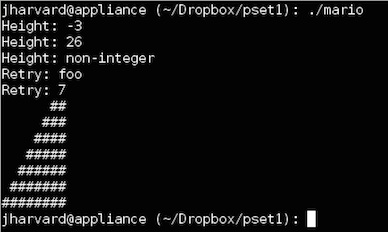

Mario
=====

Mario.c is a program I created for CS50 offered via EdX. It creates a half-pyramid using "#" for Mario to jump on. The height of the half-pyramid is defined by the user's input. The height that users type in is restricted to a non-negative integer no greater than 23. If the user fail to type in an valid input, the program will keep asking users for other inputs.  

